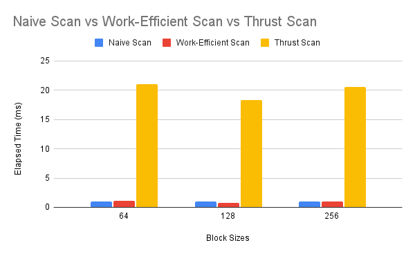
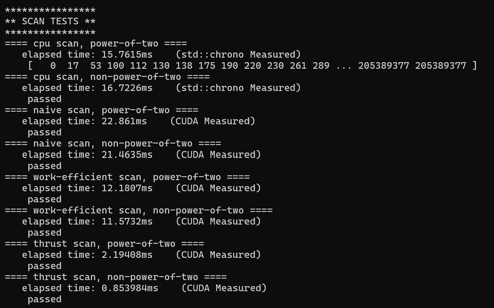
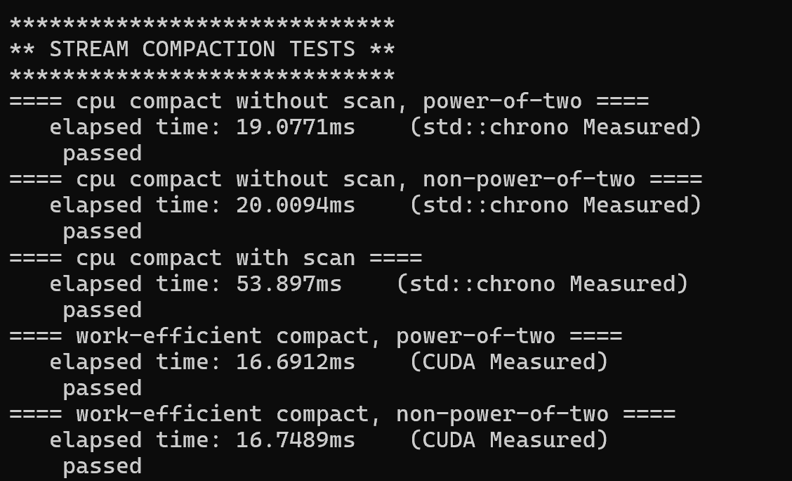

# University of Pennsylvania, CIS 5650: GPU Programming and Architecture
## Project 2 - Stream Compaction 

* Zwe Tun
  * LinkedIn: https://www.linkedin.com/in/zwe-tun-6b7191256/
* Tested on: Intel(R) i7-14700HX, 2100 Mhz, RTX 5060 Laptop

## Overview 
Stream compaction is a widely used algorithm with applications in areas such as image compression, data filtering, and parallel computing. This project explores four different implementations of stream compaction:

- CPU compaction without scan

- CPU compaction with scan

- GPU-based compaction

Each method demonstrates a different approach to optimizing performance and leveraging hardware capabilities. The goal is to analyze the performance trade-offs and efficiency of each implementation.

## Implementation 

###  CPU compaction without scan 
This implementation uses an iterative approach that incrementally places non-zero elements from the input array into an output array. An index counter tracks the next available position in the output. 

### CPU compaction with scan 
In this approach, an exclusive scan is introduced to calculate the output indices of the non-zero elements. The scan is performed using an iterative loop based on the following formula:

x[i] = x[i - 1] + input[i - 1]

Once the scan array is generated, we pass over the input. For each element i, if input[i] is non-zero, we place it into the output array at the position defined by scan[i].

### GPU-based compaction
The GPU version builds on the scan-based CPU approach. Its performance depends on two scan implementations:

Naive Scan:
Uses GPU threads to compute the scan in multiple layers. At each layer, threads read from specific indices and write to new indices, all in place, gradually building up the scan. 

Work-Efficient Scan:
Uses two phases:

Up-sweep: Performs a parallel reduction to build a balanced binary tree of partial sums.

Down-sweep: Traverses back down the tree to compute the exclusive scan in-place. At each pass, a node passes its value to its left child, and sets the right child to the sum of the previous left child’s value and its value. 

Once the scan is complete, the result is copied back to the host (CPU), where the compaction is performed

## Performance Analysis
To evaluate and compare each implementation, a benchmark is used based on the Thrust API, specifically leveraging thrust::exclusive_scan. Performance is measured for both CPU and GPU executions by wrapping each in a performance timer class. The CPU execution time is recorded using std::chrono for high-precision timing, while GPU timing is measured using CUDA events.

Note, memory allocation and transfer operations (cudaMalloc, cudaMemcpy, etc.) are excluded from the timing results.

Performance across various GPU block sizes for 256 array size, 128 block size used for futher tests. 

Performance results for 8,388,608 size array, 128 block size.

## Questions 
# To guess at what might be happening inside the Thrust implementation (e.g. allocation, memory copy), take a look at the Nsight timeline for its execution. Your analysis here doesn't have to be detailed, since you aren't even looking at the code for the implementation.
Write a brief explanation of the phenomena you see here.

Looking at the timeline, we can observe numerous memory operations and multiple kernel launches. These kernel launches appear to be synchronized and follow a pattern similar to the scan approaches used in this project's algorithm.

# Can you find the performance bottlenecks? Is it memory I/O? Computation? Is it different for each implementation?
For the CPU implementation, the bottleneck is predominantly computation based on the size of the array. Since the CPU executes sequentially main cost is due to math operations. For the GPU, memory I/O will make up the majority of the cost. Computation is parallelized through threads so global memory accesses and copies will be limiting. 
